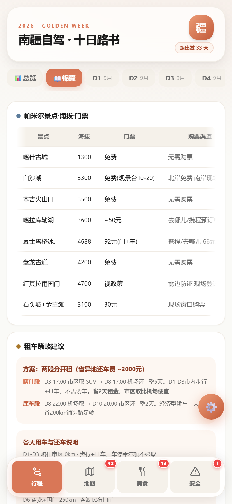
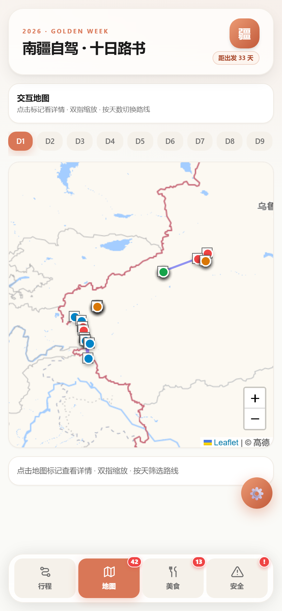
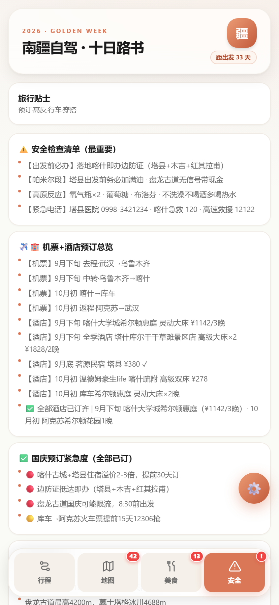

<p align="center">
  
  
  
  
</p>

<h1 align="center">🗺️ 南疆路书 · Joes' Roadbook</h1>

<p align="center"><b>一个打开就能用的移动端自驾路书 Web App —— 倒计时、每日行程、地图导航、美食、预算、安全清单，全装进一个 <code>index.html</code>。</b></p>

<p align="center">把一段真实的旅行，变成别人也能「改一份数据就复用」的开源产品。</p>

<p align="center"><a href="#-应用预览">👇 先看效果</a></p>

---

## ✨ 它解决什么问题

一趟真实的新疆自驾，信息散落在备忘录、截图、订票 App、大众点评和 84 篇小红书笔记里——路上想查个餐厅、看个倒计时、确认边防证，要在五六个 App 间反复横跳。

**南疆路书**把这个场景收进一个网页：打开即用，离线可看，装到主屏像原生 App。它不是一篇游记，而是一份**随身的行程操作系统**。

> 当前内置示例是「南疆 10 日自驾」（喀什 · 帕米尔 · 库车 · 阿克苏），但整个项目的精髓在于——**你可以把它变成任何一段旅程**。

---

## 🚀 核心特性

| 模块 | 能力 |
|------|------|
| **🏠 仪表盘** | 64px 大字出发倒计时 · 今日卡片/进度轴 · 4 个快捷入口 · 全量行程概览 · 「回到今天」浮窗 |
| **📅 行程** | 每日时间轴（时间点 + 必去/出片/美食/避坑/交通 五类标签）· 每地一键唤起多地图导航 · 租车内嵌说明 |
| **🗺️ 地图** | 基于 Leaflet，**高德 → OSM → ArcGIS 三图源自动降级**；全量 POI 标注 + 每日彩色路线；支持总览/锦囊/按天筛选 |
| **🍽️ 美食** | 23 家餐厅（喀什/库车/阿克苏）· 每家可点开看地址/介绍/特色菜 · 喀什按小红书聚类做「硬核主食/街头小吃/甜品饮品」三分类 Tab + 吃货避坑指南 |
| **💰 预算** | 14 项真实花销看板（已订/估算进度条 + 人均汇总） |
| **🎒 装备** | 高原自驾防高反装备清单（氧气/衣物/证件/电子/车载） |
| **⚠️ 安全** | 边防证办理 · 高反装备 · 紧急电话 · 帕米尔自驾注意事项 |
| **🧭 导航** | 点「导航」弹出 **高德/百度/腾讯/Apple 地图** 四选一，谁装了点谁 |
| **🛠️ 数据驱动** | 右下角 ⚙️ 内嵌编辑器：**导出 / 导入 JSON，即刻生成你的专属路书** |
| **📱 体验** | 移动端优先 · PWA 可加到主屏 · 内联兜底样式（CDN 挂了核心 UI 仍可用）· 底部上滑半屏交互 |

---

## 📸 应用预览

<p align="center">
  
  
  
  
</p>
<p align="center">
  
  
  
  
</p>

<p align="center"><i>桌面端浏览建议右键图片 → 在新标签页打开，查看高清原图。</i></p>

---

## 🆚 和普通「游记网页」的区别

| 维度 | 普通游记页面 | 南疆路书 |
|------|------------|---------|
| 复用方式 | 看完就关，复制文案重排 | 改一份 `data.js` / 导入 JSON，立刻变成你自己的路书 |
| 信息组织 | 线性长文 | 倒计时 + 时间轴 + 地图 + 预算 + 安全，结构化随身查 |
| 弱网/离线 | 白屏 | 内联兜底样式 + PWA，信号差也能看 |
| 地图可靠 | 单个图源易挂 | 三图源自动降级，不白屏 |
| 导航 | 复制坐标手输 | 四地图一键唤起 |
| 数据隐私 | 常带追踪 | 已移除第三方埋点，干净可 fork |

---

## 🧭 设计哲学（为什么这么造）

> 一份给「后来者 / 协作者 / 开源读者」的设计说明，详细版见 [`构建过程与功能设计.md`](./构建过程与功能设计.md)。

- **单文件、零构建** ——  clone 下来不用 `npm install`、不用 `npm run dev`。旅行类开源最大的传播阻力就是「环境」，单文件把复用成本降到最低：复制一个 `.html`、改数据即可。
- **倒计时用 64px 大字** —— 首页是第一眼，倒计时是这趟旅行的情绪锚点，仪式感远超几像素的精致。
- **地图做多图源兜底** —— 国内地图瓦片环境复杂，按「可达性 + 稳定性」自动降级，弱网也不会白屏。
- **导航做四地图选择而非绑定一个** —— 不替用户决定用哪个 App，高德 POI 最准、Apple 体验最佳，交给用户选。
- **底部上滑半屏（bottom-sheet）** —— 导航 / 预算 / 餐厅详情统一用 iOS 风格半屏，路上单手可操作。
- **喀什餐厅三分类** —— 不是拍脑袋，是把 84 篇小红书笔记按「吃什么」聚类后的真实维度。
- **内联兜底样式** —— 关键布局用 CSS 变量 + 内联 style 写死，Tailwind CDN 挂了核心 UI 仍可读。
- **PWA 只做 manifest** —— 「加到主屏幕」体验很重要，但不强行做 ServiceWorker 离线，避开 Blob MIME 坑。

---

## ⚡ 三步上手

```bash
# 1. 克隆
git clone git@github.com:qqqmqu-byte/Joes-roadbook.git
cd Joes-roadbook

# 2. 本地预览（任选其一）
python -m http.server 8080      # 然后浏览器打开 http://localhost:8080
# 或直接双击 index.html

# 3. 改成你的路书
#    方式 A：编辑 data.js（见下）
#    方式 B：打开页面右下角 ⚙️ → 导出 JSON → 改完再导入
```

> ⚙️ **不想写代码？** 打开任意已部署/本地运行的页面，点右下角齿轮 → 「⬇️ 导出 JSON」拿到模板 → 按结构改成你的行程 → 「⬆️ 导入文件」或粘贴 JSON → 「✓ 应用」，页面秒变你的专属路书，数据存在浏览器本地，刷新不丢。

---

## 🛠 数据字段速览（改这些就能造路书）

所有内容集中在 **`data.js`**（运行时也会被 `localStorage` 覆盖）。结构如下：

```jsonc
{
  "tripStart": "2026-09-25T00:00:00+08:00",   // 出发时间（倒计时基准）
  "tripEnd":   "2026-10-05T23:59:59+08:00",   // 返程时间
  "days": [                                     // 每日行程
    {
      "day": 1, "date":"9月下旬·周四", "title":"抵达喀什·入住希尔顿",
      "icon":"🛬", "alt":"1300m", "drive":"0km", "intensity":"★☆☆☆☆",
      "stay":"🏨 喀什大学城希尔顿惠庭", "stayPrice":"¥1142",
      "items":[ { "t":"13:20", "p":"✈️ 去程航班", "tr":"✈️", "tag":"transit", "d":"说明" } ],
      "tip":"当日提示"
    }
  ],
  "poiCoords": { "地名": [纬度, 经度] },          // 地图打点坐标
  "mapQueries":{ "显示名": "地图搜索词" },          // 导航唤起时的搜索词
  "restaurants":[ { "n":"店名","city":"喀什","cat":"硬核主食","price":"20-30元",
                    "loc":"...","desc":"...","addr":"...","intro":"...","dishes":["抓饭"] } ],
  "travelTips":[ { "title":"⚠️ 安全检查清单","items":["..."] } ],
  "budget":    [ { "n":"项目","v":"¥1,142","real":true,"note":"备注" } ],  // 预算看板
  "gear":      [ { "cat":"防高反","desc":"氧气瓶…" } ]                       // 装备清单
}
```

想直接拿模板填空？项目根目录已附 **`data.example.json`**（由当前示例导出），照着改即可。

---

## 🚀 部署（立即可用）

静态托管即可，无需任何服务端：

- **GitHub Pages**：仓库 → Settings → Pages → 选 `main` 分支根目录。
- **Vercel / Netlify / Cloudflare Pages**：连接仓库，默认配置直接发布。
- **一键发布为应用**：在 WorkBuddy 等支持「发布为应用」的环境，直接生成公网链接，任意设备浏览器可访问。

> 注意：地图瓦片、Tailwind、Leaflet 走公共 CDN，**离线环境**下地图与部分样式会失效（核心 UI 有内联兜底）。如需完全离线，可将这些资源本地化后再部署。

---

## 🔒 隐私与脱敏

- ✅ 已**移除腾讯 beacon 埋点**，fork 后不会把访客数据回传给原作者。
- ✅ 已删除航班号、精确日期改为「9 月下旬」区间，打破可反查组合。
- ✅ 保留「武汉」作为出发城市（单独出现不具辨识度，且保留真实路书可信度）。
- ✅ 网络设备标识（MAC / Tailscale IP 等）从未进入任何文件。

---

## 🧭 路线图

- [ ] 可视化表单编辑器（不用写 JSON，网页上直接增删天数与地点）
- [ ] ServiceWorker 离线缓存（真正断网可用）
- [ ] 暗色模式 / 主题切换
- [ ] 多路线切换（同一份框架跑多条线路）
- [ ] 截图与演示动图（完善本 README 的视觉呈现）

---

## 📄 许可证与致谢

- 许可证：**MIT** —— 随意 fork、改、商用，保留版权声明即可。
- 美食数据：大众点评 + 84 篇小红书喀什美食笔记聚类整理。
- 技术：Tailwind CSS（CDN）、Leaflet（CDN）、内联 CSS 设计令牌。

---

<p align="center"><sub>南疆路书 · 一份可被复用的旅行产品 · Made with 🍉</sub></p>
